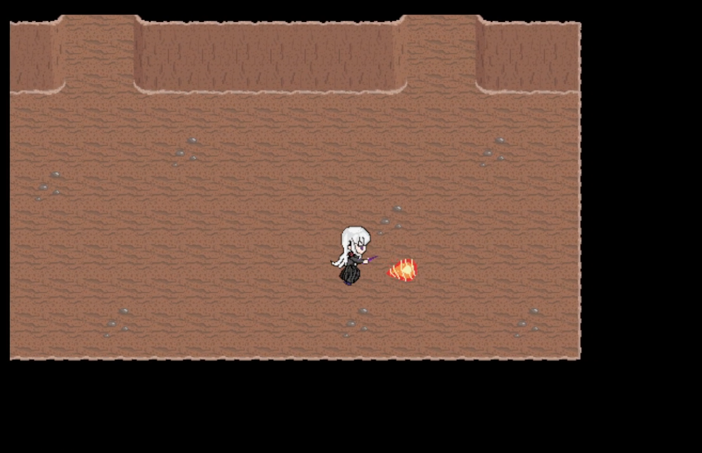
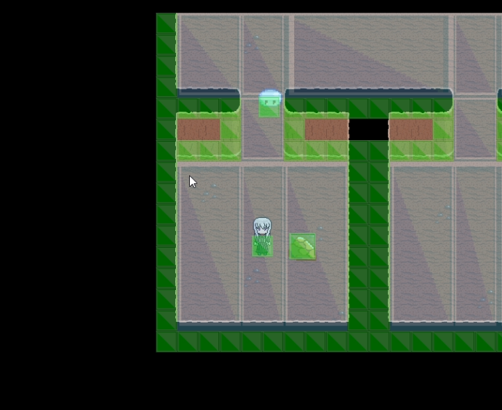

# CaveAction3_Subについての注意点
本リポジトリは下記URLのCaveAction3プロジェクトで用いるデータを作成するためのプロジェクトである。基本的にPythonを用いて各種テキストファイルを作成、及びヘッダーファイルへの変換を行っている。

https://github.com/SukakiyoLab/CaveAction3.git

## 各ディレクトリの概要
### cpp_header
変換後のC++のヘッダーファイルが格納されている。CaveAction3のプログラムを動かすにはこのディレクトリを外部ファイルとしてVisual Studioに読み込ませる必要がある。

### sub_input
変換前のテキストファイルが格納されている。
### sub_input/char_func
XML形式のデータが格納され、特にobjectsディレクトリ内のファイルにはオブジェクトデータが記載されている。
### sub_input/value_func
CSV形式のデータが格納されている。tilemapにはタイルマップの画像番号が記載されている。


## テキストファイルからC++ヘッダファイルへの変換
以下のコマンドでsub_input内に存在するすべてのテキストファイルをcpp_header内にヘッダーファイルとして変換できる。

```
python generate_cppfiles.py
```
動作確認済み環境：Python 3.12.2 , Python 3.11.3


## ゲーム風景
以下の画像は本リポジトリ上のゲームデータをCaveAction3プロジェクト上で利用した際の実行画面である。現段階でDUAL SHOCK4コントローラーにおける方向キーで移動、R2ボタンで火の玉を出現させることができる。



また、Visual StudioにおいてDebugモードで実行すると、以下のように当たり判定及びナビメッシュの表示をした状態でプレイできる。




## XML_Data構造体について
XMLファイルのデータを格納するために用意した独自のデータ構造。

## FunctionMapクラスについて
作成した関数は、メモリ領域上に動的確保したデータ構造のポインタを渡す仕組みになっており、メモリ解放を手軽に行えるようにする必要がある。そのため、データはFunctionMapを経由して利用することで、そのFunctionMapそのもののデストラクタ上で使用したデータを配置したメモリを解放するようにした。
